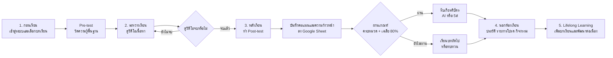
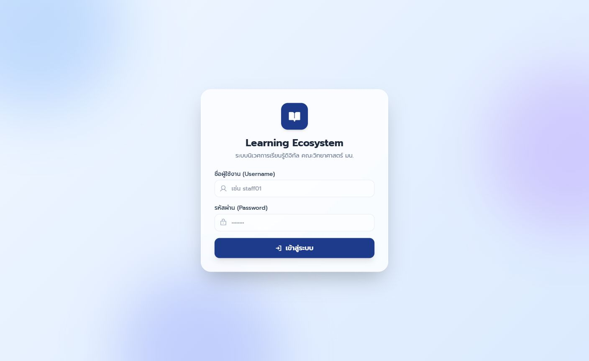
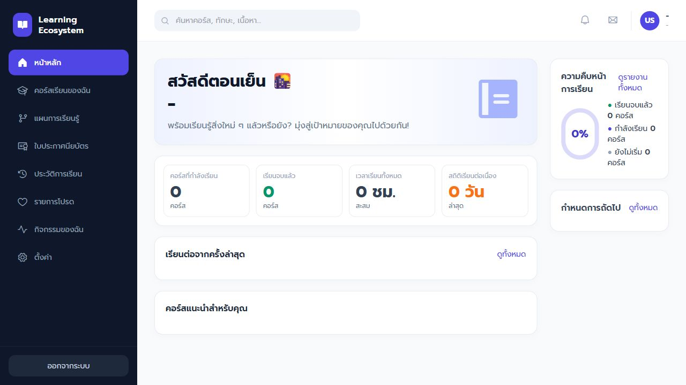
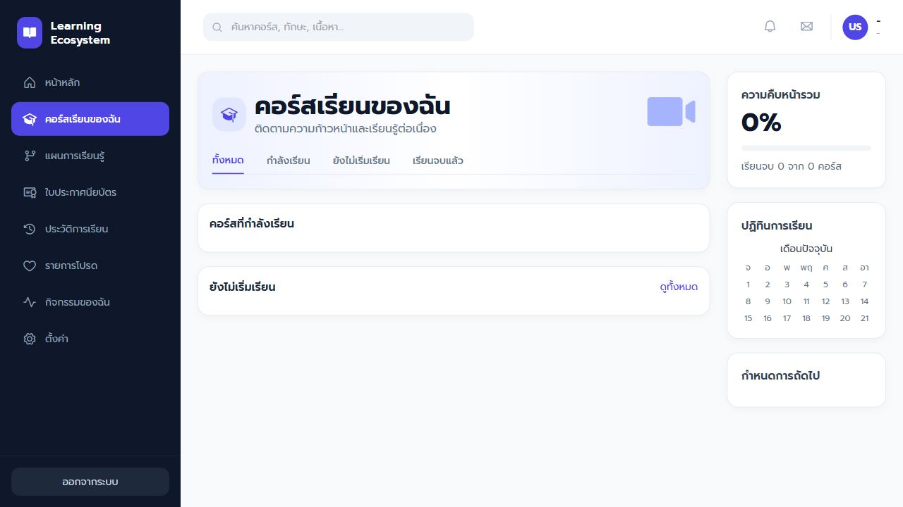
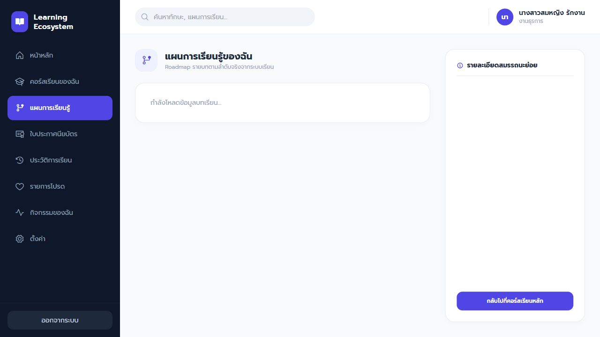
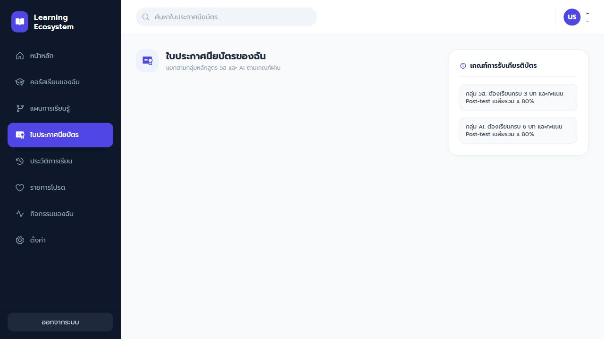
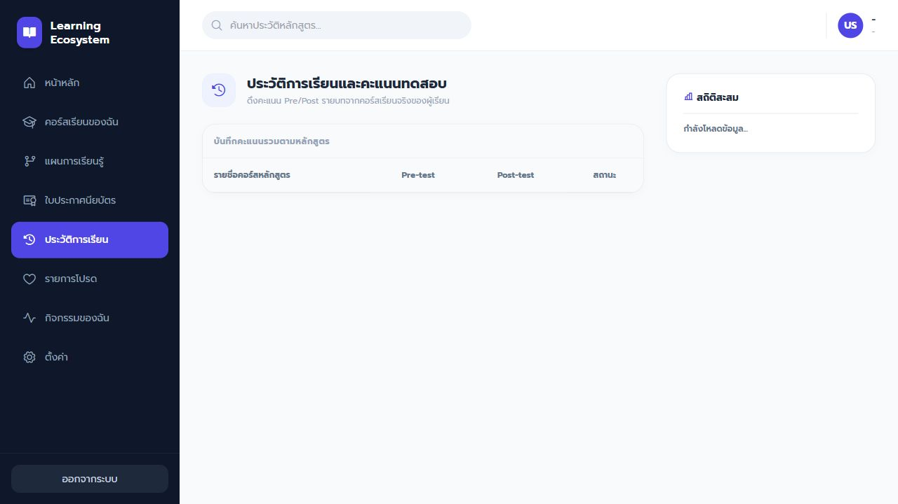
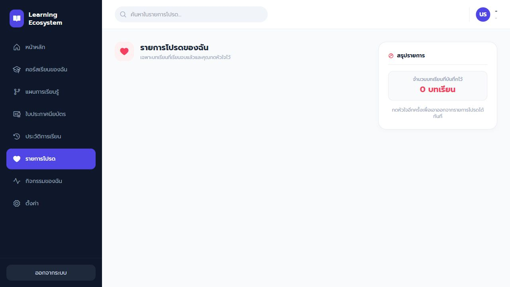
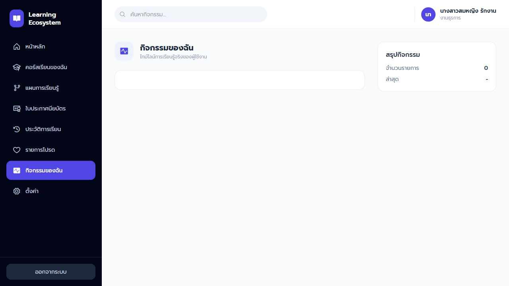
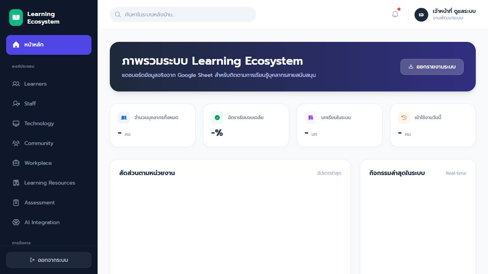

# รายงานการออกแบบระบบนิเวศการเรียนรู้ดิจิทัล

## ชื่อโครงการ

**การออกแบบระบบนิเวศการเรียนรู้ดิจิทัลสำหรับการพัฒนาสมรรถนะดิจิทัลและ AI ของเจ้าหน้าที่คณะวิทยาศาสตร์**

## จัดทำโดย

ชื่อ - นามสกุล: ............................................................

รหัสนิสิต: ............................................................

สาขาวิชา: ............................................................

รายวิชา: การจัดการระบบนิเวศการเรียนรู้ดิจิทัล

อาจารย์ผู้สอน: ............................................................

---

## 1. ข้อมูลรายวิชา (Course Information)

รายวิชาหรือหลักสูตรที่เลือกสำหรับการออกแบบระบบครั้งนี้ คือ **หลักสูตรการพัฒนาสมรรถนะดิจิทัลและ AI สำหรับเจ้าหน้าที่คณะวิทยาศาสตร์** เป็นหลักสูตรภายในองค์กรที่มุ่งพัฒนาเจ้าหน้าที่สายสนับสนุนของคณะวิทยาศาสตร์ให้สามารถใช้เทคโนโลยีดิจิทัลและ AI เพื่อเพิ่มประสิทธิภาพการทำงานจริงในหน่วยงาน

| รายการ | รายละเอียด |
|---|---|
| ชื่อรายวิชา | การพัฒนาสมรรถนะดิจิทัลและ AI สำหรับเจ้าหน้าที่คณะวิทยาศาสตร์ |
| ระดับชั้น/กลุ่มเป้าหมาย | การอบรมพัฒนาบุคลากรภายในคณะวิทยาศาสตร์ |
| จำนวนผู้เรียน | 80 คน |
| รูปแบบการจัดการเรียนรู้ปัจจุบัน | การเรียนรู้ด้วยตนเองผ่านระบบเว็บ ประกอบด้วยวิดีโอ แบบทดสอบก่อนเรียน แบบทดสอบหลังเรียน ระบบติดตามความก้าวหน้า และระบบเกียรติบัตร |
| ฐานข้อมูลที่ใช้ | Google Sheet เชื่อมผ่าน Google Apps Script API |
| กลุ่มเนื้อหาหลัก | AI สำหรับงานสนับสนุน 6 บท และ 5ส สำหรับการปรับปรุงงาน 3 บท |

### คำอธิบายรายวิชา

หลักสูตรนี้ออกแบบขึ้นเพื่อพัฒนาเจ้าหน้าที่คณะวิทยาศาสตร์ให้มีความรู้และทักษะด้านดิจิทัล AI และการจัดระบบงานด้วยแนวคิด 5ส โดยเนื้อหาเน้นการนำไปใช้กับงานจริง เช่น งานธุรการ งานเอกสาร งานการเงินและพัสดุ งานบริการการศึกษา งานนโยบายและแผน งานห้องปฏิบัติการ และงานสนับสนุนอื่น ๆ ภายในคณะ

ระบบการเรียนรู้ถูกออกแบบให้ผู้เรียนสามารถเรียนได้ตามเวลาที่สะดวกผ่านเว็บแอปพลิเคชัน มีการกำหนดลำดับการเรียนอย่างชัดเจน เริ่มจากการทำ Pre-test ดูวิดีโอให้จบ และทำ Post-test หลังเรียน ระบบจะบันทึกคะแนน ความก้าวหน้า และสถานะการเรียนลงฐานข้อมูลกลาง เพื่อให้ผู้เรียนและผู้ดูแลสามารถติดตามผลได้อย่างต่อเนื่อง

### ปัญหาหรือความท้าทายของรายวิชา

การพัฒนาบุคลากรในองค์กรมีข้อจำกัดหลายด้าน เจ้าหน้าที่แต่ละคนมีเวลาว่างไม่ตรงกัน มีพื้นฐานดิจิทัลแตกต่างกัน และมีภาระงานประจำที่ทำให้ไม่สามารถเข้าร่วมอบรมแบบพร้อมกันได้เสมอ นอกจากนี้การอบรมแบบเดิมมักมีปัญหาเรื่องการติดตามผลหลังอบรม เช่น ไม่ทราบว่าใครเรียนถึงบทใด คะแนนก่อนเรียนและหลังเรียนอยู่ที่ใด และข้อมูลการได้รับเกียรติบัตรไม่เชื่อมโยงกับผลการเรียนอย่างเป็นระบบ

ระบบนี้จึงถูกออกแบบมาเพื่อแก้ปัญหาดังกล่าว โดยรวมข้อมูลผู้เรียน บทเรียน คะแนน ความก้าวหน้า และเกียรติบัตรไว้ในระบบเดียว ช่วยให้ผู้เรียนเห็นพัฒนาการของตนเอง และช่วยให้ผู้ดูแลสามารถวิเคราะห์ภาพรวมการเรียนรู้ของเจ้าหน้าที่แต่ละหน่วยงานได้

---

## 2. การวิเคราะห์ผู้เรียน (Learner Analysis)

### ลักษณะของผู้เรียน

ผู้เรียนในระบบนี้คือเจ้าหน้าที่สายสนับสนุนของคณะวิทยาศาสตร์ ซึ่งมาจากหลายหน่วยงาน เช่น งานธุรการ งานการเงินและพัสดุ งานนโยบายและแผน งานบริการการศึกษา งานห้องปฏิบัติการ งานกิจการนิสิต และโครงการต่าง ๆ ผู้เรียนส่วนใหญ่เป็นวัยทำงาน มีประสบการณ์ในการปฏิบัติงานจริง แต่มีระดับความคุ้นเคยกับเทคโนโลยีและ AI แตกต่างกัน

ช่วงวัย: วัยทำงานตอนต้นถึงวัยทำงานตอนกลาง

พื้นฐานความรู้: มีความรู้ตามหน้าที่งานของตนเอง แต่พื้นฐานด้าน AI และระบบดิจิทัลแตกต่างกัน

ทักษะดิจิทัล: ระดับพื้นฐานถึงปานกลาง บางคนใช้งานเครื่องมือออนไลน์ได้ดี ขณะที่บางคนต้องการคำแนะนำที่ชัดเจน

พฤติกรรมการเรียนรู้: ต้องการเรียนแบบยืดหยุ่น ใช้เวลาสั้น เข้าใจง่าย และเห็นประโยชน์กับงานจริงทันที

### ความต้องการในการเรียนรู้

ผู้เรียนต้องการระบบที่ใช้งานง่าย เมนูชัดเจน เรียนผ่านโทรศัพท์มือถือได้ และสามารถกลับมาเรียนต่อได้โดยข้อมูลไม่หาย ผู้เรียนยังต้องการเห็นความก้าวหน้าของตนเอง เช่น เรียนไปกี่บท คะแนนเป็นเท่าไร เหลือบทเรียนใดบ้าง และมีสิทธิ์ได้รับเกียรติบัตรหรือยัง

### Pain Point ของผู้เรียน

ปัญหาสำคัญคือผู้เรียนไม่ต้องการระบบที่ซับซ้อน เพราะมีภาระงานประจำอยู่แล้ว หากระบบใช้งานยาก ผู้เรียนอาจไม่กลับมาเรียนต่อ อีกทั้งการเรียนออนไลน์มักเกิดปัญหาการเปิดวิดีโอทิ้งไว้หรือข้ามเนื้อหา ระบบจึงต้องออกแบบให้มีเงื่อนไขการเรียน เช่น ต้องทำ Pre-test ก่อน ต้องดูวิดีโอให้จบก่อน จึงจะทำ Post-test ได้ เพื่อให้ผลการเรียนสะท้อนการเรียนรู้จริงมากขึ้น

---

## 3. เป้าหมายการเรียนรู้ (Learning Goals)

### ผลลัพธ์การเรียนรู้ที่ต้องการ

| ด้านผลลัพธ์ | รายละเอียดผลลัพธ์การเรียนรู้ |
|---|---|
| Knowledge | ผู้เรียนเข้าใจพื้นฐาน AI, Digital Literacy, การใช้ AI อย่างรับผิดชอบ และหลัก 5ส สำหรับการปรับปรุงงานในองค์กร |
| Skills | ผู้เรียนสามารถนำ AI ไปช่วยงานเอกสาร การสรุปข้อมูล การวิเคราะห์เบื้องต้น การสื่อสาร และการจัดระบบงานให้มีประสิทธิภาพมากขึ้น |
| Attitude | ผู้เรียนมีทัศนคติที่ดีต่อการเรียนรู้เทคโนโลยี เปิดรับการเปลี่ยนแปลง และตระหนักถึงจริยธรรมในการใช้ AI และข้อมูล |

### สมรรถนะสำคัญที่ต้องการพัฒนา

ระบบนี้ออกแบบเพื่อพัฒนาสมรรถนะสำคัญหลายด้าน ได้แก่ Critical Thinking, Creativity, Collaboration, Communication, Digital Literacy, AI Literacy และ Lifelong Learning โดยเฉพาะ Digital Literacy และ AI Literacy ถือเป็นสมรรถนะหลักที่สอดคล้องกับบริบทการทำงานยุคปัจจุบันของเจ้าหน้าที่คณะวิทยาศาสตร์

---

## 4. แนวคิดระบบนิเวศการเรียนรู้ดิจิทัล

### แนวคิดหลักของระบบนิเวศ

แนวคิดหลักของระบบคือการสร้างพื้นที่การเรียนรู้ดิจิทัลที่เชื่อมโยงผู้เรียน เนื้อหา เทคโนโลยี การประเมิน และข้อมูลจริงเข้าด้วยกัน ระบบไม่ได้เป็นเพียงแหล่งเก็บวิดีโอ แต่เป็นระบบนิเวศที่มีเส้นทางการเรียนรู้ มีการวัดผล มีการสะสมความก้าวหน้า และมีข้อมูลสนับสนุนการตัดสินใจของผู้ดูแล

ระบบนี้ใช้ Google Sheet เป็นฐานข้อมูลกลาง เชื่อมกับ Google Apps Script API และหน้าเว็บสำหรับผู้เรียนและผู้ดูแล ผู้เรียนสามารถเข้าสู่ระบบ เรียนบทเรียน ทำแบบทดสอบ ดูประวัติการเรียน และดาวน์โหลดเกียรติบัตรเมื่อผ่านเกณฑ์ ส่วนผู้ดูแลสามารถดูภาพรวมบุคลากร หน่วยงาน ความก้าวหน้า คะแนน และรายงานผลการเรียนรู้ได้

### จุดเด่นของระบบ

จุดเด่นสำคัญคือระบบถูกออกแบบเฉพาะสำหรับเจ้าหน้าที่คณะวิทยาศาสตร์ ไม่ใช่ระบบการเรียนทั่วไป เนื้อหา บทเรียน เมนู และการวิเคราะห์ข้อมูลจึงยึดบริบทงานสนับสนุนของคณะเป็นหลัก ระบบยังมีการบันทึกข้อมูลจริง เช่น คะแนน Pre-test/Post-test ความก้าวหน้า รายการโปรด ประวัติการเรียน และสถานะเกียรติบัตร ทำให้ข้อมูลไม่หายเมื่อผู้เรียนออกจากระบบแล้วกลับมาใหม่

### ปรัชญาและแนวคิดที่ใช้

ระบบนี้ประยุกต์ใช้แนวคิด AI-TPACK เพื่อเชื่อมความรู้ด้านเนื้อหา วิธีสอน เทคโนโลยี และ AI เข้าด้วยกัน ใช้ Design Thinking เพื่อเข้าใจปัญหาของผู้เรียน ใช้ ADDIE ในการวิเคราะห์ ออกแบบ พัฒนา นำไปใช้ และประเมินผล ใช้ Lifelong Learning เพื่อส่งเสริมการเรียนรู้อย่างต่อเนื่อง และใช้ Learning Ecosystem เพื่อมองการเรียนรู้เป็นเครือข่ายของผู้เรียน เทคโนโลยี ทรัพยากร และบริบทการทำงาน

---

## 5. การออกแบบ Learning Ecosystem

การออกแบบระบบนิเวศการเรียนรู้ของโครงการนี้ใช้แนวคิดว่า การเรียนรู้ของเจ้าหน้าที่ไม่ได้เกิดจากบทเรียนเพียงอย่างเดียว แต่เกิดจากการเชื่อมโยงระหว่างผู้เรียน ผู้ดูแลระบบ เทคโนโลยี แหล่งเรียนรู้ การประเมินผล และบริบทการทำงานจริงภายในคณะวิทยาศาสตร์ ดังนั้นระบบจึงออกแบบให้ทุกองค์ประกอบสนับสนุนกันเป็นวงจรเดียว

| องค์ประกอบ | การออกแบบในระบบ | บทบาทต่อการเรียนรู้ |
|---|---|---|
| Learners | เจ้าหน้าที่คณะวิทยาศาสตร์จำนวน 80 คนจากหลายหน่วยงาน | เป็นศูนย์กลางของระบบ เรียนตามเส้นทางที่กำหนดและเห็นความก้าวหน้าของตนเอง |
| Teachers | ผู้ดูแลระบบและผู้รับผิดชอบการพัฒนาบุคลากร | ออกแบบบทเรียน ตรวจสอบข้อมูล ติดตามผล และปรับปรุงกิจกรรม |
| Technology | Web App, Google Apps Script, Google Sheet, YouTube Embed, Dashboard | เป็นโครงสร้างหลักที่เชื่อมผู้เรียน บทเรียน คะแนน และรายงานไว้ด้วยกัน |
| Community | การเรียนรู้ร่วมกันภายในหน่วยงานและคณะวิทยาศาสตร์ | ทำให้ผู้เรียนแลกเปลี่ยนวิธีใช้ AI และ 5ส กับงานจริงของตนเองได้ |
| Workplace | งานธุรการ งานการเงินและพัสดุ งานบริการการศึกษา งานนโยบายและแผน งานห้องปฏิบัติการ | ทำให้เนื้อหาการเรียนเชื่อมโยงกับปัญหาและภารกิจจริงของเจ้าหน้าที่ |
| Learning Resources | บทเรียน AI 6 บท และบทเรียน 5ส 3 บท พร้อมวิดีโอและแบบทดสอบ | เป็นทรัพยากรหลักสำหรับการเรียนรู้ด้วยตนเองและการทบทวน |
| Assessment | Pre-test, Post-test, Progress Tracking, Certificate Criteria, Learning Analytics | ใช้วัดความรู้ ความก้าวหน้า ผลสัมฤทธิ์ และสิทธิ์รับเกียรติบัตร |
| AI Integration | เนื้อหา AI และแนวทางประยุกต์ AI ในงานสนับสนุน | ช่วยให้ผู้เรียนพัฒนาทักษะ AI Literacy และนำไปใช้เพิ่มประสิทธิภาพงาน |

เมื่อนำองค์ประกอบทั้งหมดมารวมกัน ระบบจะทำหน้าที่เป็นพื้นที่เรียนรู้กลางของคณะวิทยาศาสตร์ ผู้เรียนสามารถเริ่มเรียน ทำแบบทดสอบ ดูวิดีโอ ติดตามคะแนน และรับเกียรติบัตรได้ในระบบเดียว ส่วนผู้ดูแลสามารถเห็นข้อมูลภาพรวม เช่น จำนวนผู้เรียน ความก้าวหน้า คะแนนเฉลี่ย และสัดส่วนตามหน่วยงาน เพื่อนำข้อมูลไปใช้พัฒนาการอบรมครั้งต่อไป

---

## 6. การออกแบบวิธีการจัดการเรียนรู้ (Pedagogy Design)

ระบบนี้ใช้แนวคิด Active Learning เพราะผู้เรียนไม่ได้เพียงรับชมวิดีโอ แต่ต้องทำแบบทดสอบและสะท้อนผลการเรียนผ่านคะแนนและความก้าวหน้า ใช้ Flipped Classroom เพราะผู้เรียนศึกษาเนื้อหาด้วยตนเองก่อน แล้วนำความรู้ไปใช้กับงานจริง ใช้ Inquiry-Based Learning เพื่อให้ผู้เรียนตั้งคำถามกับงานของตนเองว่า AI หรือ 5ส ช่วยปรับปรุงงานอย่างไร ใช้ Collaborative Learning ในระดับหน่วยงาน และใช้ Authentic Learning เพราะเนื้อหาผูกกับงานจริงของเจ้าหน้าที่

ตัวอย่างกิจกรรมการเรียนรู้ ได้แก่ การทำแบบทดสอบก่อนเรียนเพื่อสำรวจพื้นฐาน การดูวิดีโอเนื้อหา การทำแบบทดสอบหลังเรียน การบันทึกผลคะแนน การเลือกบทเรียนเป็นรายการโปรดหลังเรียนจบ และการติดตามความก้าวหน้าจากหน้าประวัติการเรียน

---

## 7. การบูรณาการเทคโนโลยีและ AI

LMS: ใช้ระบบ Learning Ecosystem เป็นศูนย์กลางการเรียนรู้

AI Tools: ใช้เป็นเนื้อหาและแนวทางฝึกประยุกต์ AI กับงานจริง

Social Media: สามารถใช้สำหรับประกาศข่าวสารหรือสร้างชุมชนเรียนรู้ภายในคณะ

Analytics: ใช้วิเคราะห์ความก้าวหน้า คะแนน การจบบทเรียน และสิทธิ์เกียรติบัตร

Mobile Learning: หน้าเว็บออกแบบให้รองรับการใช้งานบนโทรศัพท์มือถือ

AI ทำหน้าที่เป็นผู้ช่วยในการทำงาน เช่น ช่วยร่างเอกสาร สรุปข้อมูล วิเคราะห์ข้อมูลเบื้องต้น และสร้างแนวทางการสื่อสาร ส่วนผู้เรียนใช้ AI เพื่อเพิ่มประสิทธิภาพงานประจำ และผู้ดูแลใช้ AI เพื่อช่วยออกแบบบทเรียน วิเคราะห์ผล และปรับปรุงระบบการเรียนรู้

---

## 8. Learning Flow / Learning Journey

เส้นทางการเรียนรู้ของระบบถูกออกแบบให้เป็นลำดับชัดเจน เพื่อให้ผู้เรียนค่อย ๆ เรียนรู้จากการสำรวจพื้นฐาน ไปสู่การเรียนเนื้อหา การประเมินผล และการต่อยอดการเรียนรู้ในระยะยาว ระบบจะบันทึกข้อมูลทุกขั้นตอนลงฐานข้อมูลกลาง เพื่อให้ผู้เรียนกลับมาเรียนต่อได้ และให้ผู้ดูแลติดตามผลได้จากข้อมูลจริง

| ขั้นตอน | กิจกรรมของผู้เรียน | สิ่งที่ระบบทำ | ผลลัพธ์ที่เกิดขึ้น |
|---|---|---|---|
| 1. ก่อนเรียน | เข้าสู่ระบบ เลือกบทเรียน และทำ Pre-test | ตรวจสอบบัญชีผู้ใช้ บันทึกคะแนนก่อนเรียน และเปิดสถานะเริ่มบทเรียน | ผู้เรียนรู้ระดับพื้นฐานของตนเอง และระบบมีข้อมูลตั้งต้น |
| 2. ระหว่างเรียน | ดูวิดีโอเนื้อหาบทเรียนในระบบ | แสดงวิดีโอ ฝัง YouTube และป้องกันการเลื่อนข้ามเพื่อจบบทเร็วเกินไป | ผู้เรียนได้รับเนื้อหาครบก่อนเข้าสู่การประเมินหลังเรียน |
| 3. หลังเรียน | ทำ Post-test หลังดูวิดีโอจบ | คำนวณคะแนน บันทึกผลลง Google Sheet และอัปเดตความก้าวหน้า | ผู้เรียนเห็นคะแนนหลังเรียน และระบบรู้ว่าบทเรียนจบแล้วหรือไม่ |
| 4. การเรียนรู้นอกห้องเรียน | ทบทวนบทเรียน ดูประวัติการเรียน กดรายการโปรด และติดตามเกียรติบัตร | แสดงประวัติ คะแนน รายการโปรด และสถานะเกียรติบัตร | ผู้เรียนสามารถเรียนซ้ำและติดตามพัฒนาการของตนเองได้ |
| 5. Lifelong Learning Extension | เรียนบทต่อไปหรือเรียนหลักสูตรใหม่ในอนาคต | เพิ่มบทเรียนใหม่ วิเคราะห์ข้อมูล และแนะนำแนวทางพัฒนาต่อ | เกิดวัฒนธรรมการเรียนรู้อย่างต่อเนื่องภายในคณะวิทยาศาสตร์ |

แผนผังต่อไปนี้แสดงเส้นทางการเรียนรู้ตั้งแต่ผู้เรียนเข้าสู่ระบบจนถึงการเรียนรู้ต่อเนื่องในอนาคต

จากแผนผังจะเห็นว่าระบบไม่ได้จบแค่การทำแบบทดสอบ แต่ต่อยอดไปสู่การเก็บข้อมูลการเรียนรู้ การให้เกียรติบัตร และการวางแผนพัฒนาบุคลากรในระยะยาว จุดสำคัญคือข้อมูลทุกขั้นตอนถูกบันทึกไว้ ทำให้ผู้เรียนไม่สูญเสียความก้าวหน้า และผู้ดูแลสามารถใช้ข้อมูลเพื่อวิเคราะห์ภาพรวมของคณะได้

---

## 9. การประเมินผล (Assessment Design)

การประเมินผลของระบบออกแบบให้ครอบคลุมทั้งความรู้ก่อนเรียน ผลลัพธ์หลังเรียน การนำไปใช้กับงานจริง และข้อมูลพฤติกรรมการเรียนรู้ ระบบจึงไม่ได้วัดเพียงคะแนนสอบ แต่ใช้ข้อมูลหลายรูปแบบเพื่อสะท้อนการเรียนรู้ของเจ้าหน้าที่คณะวิทยาศาสตร์อย่างรอบด้าน

| วิธีประเมิน | เครื่องมือ | สิ่งที่วัด | การใช้ข้อมูลในระบบ |
|---|---|---|---|
| Pre-test | แบบทดสอบก่อนเรียนในแต่ละบท | ความรู้พื้นฐานก่อนเรียน ความเข้าใจเดิม และช่องว่างการเรียนรู้ | บันทึกคะแนนตั้งต้นเพื่อเปรียบเทียบกับผลหลังเรียน |
| Assignment | งานประยุกต์ เช่น ให้ผู้เรียนทดลองใช้ AI สรุปเอกสาร หรือจัดระบบไฟล์ตาม 5ส | ความสามารถในการนำความรู้ไปใช้กับงานจริง | ใช้เป็นหลักฐานการประยุกต์ใช้ในบริบทหน่วยงาน |
| Project | โครงงานย่อยเพื่อปรับปรุงงานสนับสนุนด้วย AI หรือ 5ส | การคิดวิเคราะห์ การออกแบบแนวทางแก้ปัญหา และผลลัพธ์เชิงปฏิบัติ | ใช้ประเมินทักษะขั้นสูงและความคิดสร้างสรรค์ |
| Reflection | แบบสะท้อนคิดหลังเรียนหรือหลังทำกิจกรรม | ทัศนคติ การรับรู้คุณค่าของบทเรียน และแผนการนำไปใช้ | ใช้ปรับปรุงบทเรียนและสนับสนุน Lifelong Learning |
| Learning Analytics | Dashboard, Progress, QuizAttempts, Certificates, Users | จำนวนผู้เรียนที่เริ่มเรียน จบบทเรียน คะแนนเฉลี่ย ความก้าวหน้ารายบุคคลและรายหน่วยงาน | ใช้ติดตามภาพรวม ออกเกียรติบัตร และวางแผนพัฒนาบุคลากร |

เงื่อนไขสำคัญของระบบคือ ผู้เรียนต้องทำ Post-test และมีคะแนนเฉลี่ยตามหมวดตั้งแต่ 80% ขึ้นไปจึงจะมีสิทธิ์รับเกียรติบัตร เช่น หากเรียนบท AI ครบ 6 บทและคะแนน Post-test เฉลี่ยผ่าน 80% จะได้รับเกียรติบัตรหมวด AI หากเรียนบท 5ส ครบ 3 บทและผ่านเกณฑ์เดียวกัน จะได้รับเกียรติบัตรหมวด 5ส

---

## 10. ต้นแบบนวัตกรรม (Prototype)

ต้นแบบของระบบประกอบด้วยหน้า Login, หน้า Home ผู้เรียน, หน้า My Courses, หน้า Learning Plan, หน้า Certificates, หน้า History, หน้า Favorites, หน้า Activities และหน้า Admin Dashboard สำหรับผู้ดูแล ระบบถูกออกแบบให้เป็น LMS Prototype และ Mobile Learning System ที่เชื่อมต่อข้อมูลจริงกับ Google Sheet

ต้นแบบนี้แสดงให้เห็นการเรียนรู้แบบเป็นลำดับ ได้แก่ ทำ Pre-test ดูวิดีโอ ทำ Post-test ติดตามความก้าวหน้า และรับเกียรติบัตรตามเกณฑ์ คะแนน Post-test รวมตั้งแต่ 80% ขึ้นไปจึงสามารถรับเกียรติบัตรได้

### ภาพต้นแบบ / Screenshot / Wireframe

ภาพต้นแบบต่อไปนี้เป็นหน้าจอจริงจากระบบ Learning Ecosystem ที่ออกแบบสำหรับเจ้าหน้าที่คณะวิทยาศาสตร์ โดยแสดงทั้งมุมมองผู้เรียนและมุมมองผู้ดูแลระบบ

| หน้าจอ | บทบาทของหน้าในระบบ |
|---|---|
| Login | ตรวจสอบตัวตนของเจ้าหน้าที่ก่อนเข้าสู่ระบบ |
| Home ผู้เรียน | สรุปภาพรวมการเรียน คอร์สล่าสุด และสถิติการเรียนรู้ |
| My Courses | แสดงบทเรียนทั้งหมด สถานะกำลังเรียน ยังไม่เริ่ม และเรียนจบแล้ว |
| Learning Plan | แสดง Roadmap และสมรรถนะย่อยที่เชื่อมกับบทเรียน |
| Certificates | แสดงสิทธิ์รับเกียรติบัตรตามหมวด AI และ 5ส |
| History | แสดงประวัติการเรียน คะแนน Pre-test/Post-test และสถานะบทเรียน |
| Favorites | เก็บบทเรียนที่เรียนจบแล้วและต้องการกลับมาทบทวน |
| Activities | แสดงกิจกรรมล่าสุด เช่น เข้าสู่ระบบ ทำแบบทดสอบ และเรียนจบ |
| Admin Dashboard | แสดงข้อมูลภาพรวมสำหรับผู้ดูแล เช่น จำนวนผู้เรียน ความก้าวหน้า และกิจกรรมล่าสุด |

#### หน้า Login

#### หน้า Home ผู้เรียน

#### หน้า My Courses

#### หน้า Learning Plan

#### หน้า Certificates

#### หน้า History

#### หน้า Favorites

#### หน้า Activities

#### หน้า Admin Dashboard

---

## 11. การวิเคราะห์เชิงจริยธรรมและผลกระทบ

AI Ethics: ผู้เรียนต้องเข้าใจว่า AI เป็นเครื่องมือช่วยงาน ไม่ใช่เครื่องมือที่ใช้แทนการตัดสินใจทั้งหมด ผลลัพธ์จาก AI ต้องได้รับการตรวจสอบก่อนนำไปใช้จริง

Data Privacy: ระบบเก็บข้อมูลผู้เรียน คะแนน และประวัติการเรียน จึงต้องจำกัดสิทธิ์การเข้าถึงข้อมูล และใช้ข้อมูลเท่าที่จำเป็น

Digital Divide: ผู้เรียนมีทักษะดิจิทัลต่างกัน ระบบจึงต้องใช้งานง่าย รองรับมือถือ และใช้ภาษาเข้าใจง่าย

Accessibility: เมนูต้องชัดเจน ตัวอักษรอ่านง่าย และผู้เรียนสามารถเข้าถึงบทเรียนได้โดยไม่ซับซ้อน

แนวทางป้องกันคือกำหนดสิทธิ์ผู้ใช้ แยกบทบาท Admin และ Staff ตรวจสอบข้อมูลก่อนเผยแพร่ ออกแบบระบบให้เป็นมิตรกับผู้ใช้ และให้ความรู้เรื่องการใช้ AI อย่างปลอดภัย

---

## 12. ความเป็นไปได้และความยั่งยืน

ระบบมีความเป็นไปได้สูง เพราะใช้เครื่องมือที่ต้นทุนต่ำและเข้าถึงง่าย เช่น Google Sheet, Google Apps Script และเว็บแอปพลิเคชัน สามารถดูแลต่อได้โดยทีมขนาดเล็ก และขยายจำนวนบทเรียนหรือผู้เรียนได้ในอนาคต

ปัจจัยสนับสนุน ได้แก่ มีฐานข้อมูลเจ้าหน้าที่จริง มีบทเรียนจริง มีระบบวัดผลจริง และมีแดชบอร์ดสำหรับผู้ดูแล ข้อจำกัดคือการดูแลความถูกต้องของข้อมูล การปรับปรุงเนื้อหาให้ทันสมัย และการสนับสนุนผู้เรียนที่ยังไม่คุ้นเคยกับระบบดิจิทัล

---

## 13. Reflection

จากการออกแบบระบบนิเวศการเรียนรู้ครั้งนี้ ทำให้เห็นว่าการพัฒนาระบบการเรียนรู้ดิจิทัลไม่ใช่เพียงการสร้างหน้าเว็บหรือใส่วิดีโอ แต่ต้องออกแบบความสัมพันธ์ระหว่างผู้เรียน เนื้อหา เทคโนโลยี การประเมิน และข้อมูลให้ทำงานร่วมกันอย่างมีความหมาย ระบบที่ดีควรทำให้ผู้เรียนรู้ว่าตนเองอยู่ตรงไหน ต้องเรียนอะไรต่อ และผลการเรียนของตนเองเป็นอย่างไร

หากพัฒนาต่อ ควรเพิ่ม AI Learning Assistant เพื่อช่วยแนะนำบทเรียนรายบุคคล เพิ่มระบบแจ้งเตือนผู้เรียนที่เรียนค้าง เพิ่มรายงานเชิงลึกระดับหน่วยงาน และพัฒนาระบบแนะนำบทเรียนตามคะแนนหรือพฤติกรรมการเรียนรู้

---

## 14. สรุปแนวคิดสำคัญ

ระบบนี้เป็นระบบนิเวศการเรียนรู้ดิจิทัลเฉพาะสำหรับเจ้าหน้าที่คณะวิทยาศาสตร์ มีจุดเด่นคือการเชื่อมข้อมูลจริงของผู้เรียน บทเรียน คะแนน ความก้าวหน้า และเกียรติบัตรไว้ในระบบเดียว ผู้เรียนสามารถเรียนรู้ได้อย่างยืดหยุ่นและต่อเนื่อง ส่วนผู้ดูแลสามารถติดตามภาพรวมและใช้ข้อมูลเพื่อพัฒนาการอบรมต่อไปได้

สิ่งที่คาดว่าจะเกิดกับผู้เรียนคือ เจ้าหน้าที่มีทักษะด้านดิจิทัลและ AI เพิ่มขึ้น สามารถนำความรู้ไปปรับใช้กับงานจริง เห็นพัฒนาการของตนเอง และเกิดวัฒนธรรมการเรียนรู้ตลอดชีวิตภายในคณะวิทยาศาสตร์

---

## หมายเหตุสำหรับการนำเสนอให้ตรงเกณฑ์ 30 คะแนน

การวิเคราะห์บริบทและปัญหา: เน้นว่าระบบแก้ปัญหาการอบรมเจ้าหน้าที่ที่มีเวลาจำกัดและพื้นฐานดิจิทัลแตกต่างกัน

การออกแบบ Learning Ecosystem: อธิบายครบ 8 องค์ประกอบ และชี้ให้เห็นความสัมพันธ์ระหว่างผู้เรียน เทคโนโลยี บทเรียน และข้อมูล

การบูรณาการ Pedagogy + Technology + AI: แสดงให้เห็นว่าการเรียนไม่ได้เป็นแค่วิดีโอ แต่มี Pre-test, Video, Post-test, Analytics และ AI Integration

ความคิดสร้างสรรค์และนวัตกรรม: ชูระบบเฉพาะเจ้าหน้าที่คณะวิทยาศาสตร์ การล็อกลำดับการเรียน และเกียรติบัตรตามคะแนนจริง

ความเป็นไปได้และความยั่งยืน: ชี้ว่าระบบใช้เครื่องมือที่ดูแลได้จริง ต้นทุนต่ำ และขยายบทเรียนได้ต่อเนื่อง
